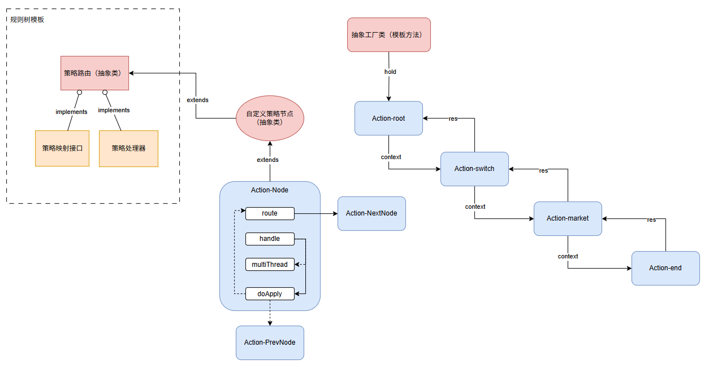

<h1 align="center" style="margin: 5px 0 30px; font-weight: bold;">拼团交易领域驱动平台</h1> <!-- 将顶部边距从 30px 改为 10px -->
<h4 align="center">B2C拼团营销交易平台</h4>

    
    

## 项目介绍
为什么需要拼团这种营销模式？

业务销量同比增速放缓，市场中存在同类竞品，消费者偏向于价低者。为了盘活沉睡用户，需要适当降低商品价格。但为了达到传播的效果，所以需要引入拼团方式，以客带客，靠用户自身传播的方式进行交易拉新。

## 项目概述
基于DDD领域驱动设计和六边形架构开发的拼团营销交易平台，参考拼多多等主流电商平台的拼团模式，实现了完整的营销交易流程。系统采用Maven多模块设计，清晰划分交易、活动、人群三大领域边界，通过责任链和工厂模式构建了灵活的规则引擎。

## 核心实现流程图
链式多分支规则树 

活动领域ActionNode设计 

基于Redis发布/订阅的动态配置中心 

责任链 

## 数据库建表
[详见数据库建表](./docs/dev-ops/mysql/sql/group_buy_plus.sql)

## 部署方式
[详见 Docker 部署](./docs/dev-ops/docker-deploy.md)

